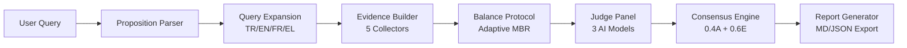
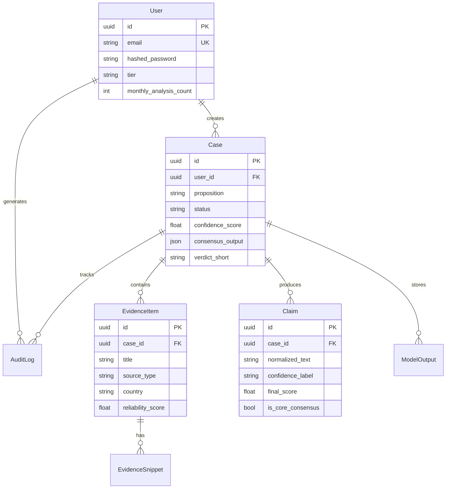

<p align="center">
  
  
  
  
  
  
</p>

<h1 align="center">📜 PolyHistory</h1>

<p align="center">
  <strong>Evidence-First Multi-Perspective Historical Analysis Platform</strong>
</p>

<p align="center">
  <em>"Aynı tarih aralığında, farklı ülkelerin ve farklı görüşlerin ne dediğini önce göster; sonra kanıt hiyerarşisine göre, denetlenebilir bir çıkarım üret."</em>
</p>

---

## 🎯 What is PolyHistory?

PolyHistory is an AI-powered historical research platform that breaks ideological echo chambers by enforcing **strict source diversity**, **hierarchical evidence weighting**, and **multi-model AI consensus**. It analyzes historical claims across national boundaries, languages, and perspectives — then produces transparent, auditable verdicts.

### Key Differentiators

| Feature | Description |
|---------|-------------|
| 🔬 **Evidence-First** | No claim without citation — every assertion traces back to verifiable sources |
| 🤖 **Multi-Model Consensus** | Three independent AI judges (Gemini, GPT, Claude) with weighted agreement scoring |
| ⚖️ **Minimum Balance Requirements** | Mandatory source diversity across perspectives, geographies, and languages |
| 🌍 **Cross-National Analysis** | Same-time-window discourse mapping across Turkish, English, French, and Greek sources |
| 📋 **Full Auditability** | Complete case files with deterministic replay capability |
| 🛡️ **Graceful Degradation** | 4-tier reliability system when AI models are unavailable |

---

## 🏗️ Architecture

```
                    ┌──────────────────────────────────────────┐
                    │          Next.js Frontend (Web)           │
                    │   Dashboard · Cases · Evidence · Export   │
                    └──────────────────┬───────────────────────┘
                                       │ REST API
                    ┌──────────────────▼───────────────────────┐
                    │          FastAPI Backend (API)            │
                    └──────────────────┬───────────────────────┘
                                       │
           ┌───────────────┬───────────┼───────────┬───────────────┐
           │               │           │           │               │
    ┌──────▼──────┐ ┌──────▼──────┐ ┌──▼───┐ ┌────▼─────┐ ┌──────▼──────┐
    │ Proposition │ │   Query     │ │Judge │ │ Balance  │ │  Consensus  │
    │   Parser    │ │  Expansion  │ │Panel │ │ Protocol │ │   Engine    │
    │  (NLP/NER)  │ │ (4 langs)   │ │      │ │  (MBR)   │ │(0.4A+0.6E)  │
    └─────────────┘ └─────────────┘ └──┬───┘ └──────────┘ └─────────────┘
                                       │
                              ┌────────┼────────┐
                              │        │        │
                        ┌─────▼───┐ ┌──▼───┐ ┌──▼─────┐
                        │ Gemini  │ │ GPT  │ │ Claude │
                        │ 3.1 Pro │ │ 5.2  │ │Opus 4.6│
                        └─────┬───┘ └──┬───┘ └──┬─────┘
                              │        │        │
                              └────────┼────────┘
                                       │
                        ┌──────────────▼──────────────┐
                        │     Graceful Degradation     │
                        │  FULL → PARTIAL → REDUCED →  │
                        │         FALLBACK             │
                        └──────────────────────────────┘
                                       │
         ┌─────────────────────────────┼─────────────────────────────┐
         │                             │                             │
  ┌──────▼──────┐              ┌───────▼───────┐            ┌───────▼───────┐
  │ PostgreSQL  │              │    Redis      │            │    Celery     │
  │ + pgvector  │              │  Cache/Queue  │            │   Workers    │
  └─────────────┘              └───────────────┘            └───────────────┘
```

### Analysis Pipeline



---

## 🛠️ Tech Stack

### Backend (`apps/api`)

| Layer | Technology | Purpose |
|-------|-----------|---------|
| **Framework** | FastAPI 0.115 | Async REST API with auto-docs |
| **Language** | Python 3.12 | Core logic |
| **Database** | PostgreSQL 16 + pgvector | Data persistence + vector similarity |
| **ORM** | SQLAlchemy 2.0 (async) | Database models |
| **Cache/Queue** | Redis 7.2 | Caching + Celery broker |
| **Task Queue** | Celery 5.3 | Background workflow processing |
| **Auth** | JWT (python-jose) + bcrypt | Token-based authentication |
| **AI Models** | Gemini 3.1 Pro, GPT-5.2, Claude Opus 4.6 | Multi-model judge panel |
| **Testing** | pytest + pytest-asyncio | Unit & integration testing |

### Frontend (`apps/web`)

| Layer | Technology | Purpose |
|-------|-----------|---------|
| **Framework** | Next.js 14 | React SSR framework |
| **Language** | TypeScript 5.3 | Type-safe frontend |
| **State** | Zustand + React Query | Client state + server state |
| **Charts** | Recharts + D3.js | Data visualization |
| **Forms** | React Hook Form + Zod | Validated form handling |
| **Styling** | Tailwind CSS 3.4 | Utility-first CSS |
| **HTTP** | Axios | API client |
| **Testing** | Jest + Testing Library | Component testing |

### Infrastructure

| Component | Technology | Purpose |
|-----------|-----------|---------|
| **Containers** | Docker + Docker Compose | Orchestration |
| **Database** | PostgreSQL 16 | Primary datastore |
| **Cache** | Redis 7.2 | Session cache + task broker |

---

## 📁 Project Structure

```
polyhistory/
├── 📄 docker-compose.yml          # Full-stack orchestration
├── 📄 prd.md                      # Product Requirements (v2.0)
├── 📄 output-spec.json            # API response schema
├── 📄 README.md                   # ← You are here
│
├── 🔧 apps/api/                   # Python Backend
│   ├── app/
│   │   ├── main.py                # FastAPI app + lifespan
│   │   ├── core/                  # Infrastructure
│   │   │   ├── config.py          # Settings (v2.0.0)
│   │   │   ├── database.py        # Async SQLAlchemy + pgvector
│   │   │   ├── security.py        # JWT + bcrypt
│   │   │   └── exceptions.py      # Custom exceptions
│   │   ├── models/                # 7 SQLAlchemy tables
│   │   │   └── __init__.py        # User, Case, Evidence, Claim, etc.
│   │   ├── schemas/               # Pydantic request/response models
│   │   ├── api/v1/                # REST endpoints
│   │   │   ├── deps.py            # Auth deps + Free Tier logic
│   │   │   └── endpoints/         # auth, cases, evidence, timeline, consensus, export
│   │   ├── services/              # Business logic
│   │   │   ├── proposition_parser.py    # NLP/NER claim parsing
│   │   │   ├── query_expansion.py       # 4-language query expansion
│   │   │   ├── evidence_builder.py      # 5-factor reliability scoring
│   │   │   ├── balance_protocol.py      # Adaptive MBR enforcement
│   │   │   ├── consensus_engine.py      # Weighted consensus (0.4A + 0.6E)
│   │   │   ├── report_generator.py      # Markdown/JSON export
│   │   │   └── judge/                   # AI model adapters
│   │   │       ├── base.py              # Abstract BaseJudge
│   │   │       ├── gemini.py            # Gemini 3.1 Pro adapter
│   │   │       ├── gpt.py              # GPT-5.2 adapter
│   │   │       ├── claude.py            # Claude Opus 4.6 adapter
│   │   │       └── orchestrator.py      # Parallel execution + degradation
│   │   └── tasks/
│   │       └── case_workflow.py         # Full analysis pipeline
│   ├── tests/                     # 74 passing tests
│   │   ├── conftest.py
│   │   ├── unit/                  # 5 test files
│   │   └── integration/           # 2 test files
│   ├── requirements.txt
│   └── Dockerfile
│
└── 🌐 apps/web/                   # Next.js Frontend
    ├── app/                       # Pages (App Router)
    │   ├── page.tsx               # Dashboard
    │   ├── auth/                  # Login/Register
    │   └── cases/                 # Case detail/list
    ├── components/                # UI components
    ├── lib/                       # API client + utilities
    ├── hooks/                     # Custom React hooks
    ├── stores/                    # Zustand state stores
    ├── types/                     # TypeScript type definitions
    └── package.json
```

---

## 🚀 Quick Start

### Prerequisites

- **Docker** 24.0+ & **Docker Compose** 2.20+
- AI model API keys (optional — deterministic fallback exists)

### 1. Clone & Configure

```bash
git clone https://github.com/your-org/polyhistory.git
cd polyhistory

# Create environment file
cp .env.example .env

# Add your API keys (optional)
# GEMINI_API_KEY=your-key
# OPENAI_API_KEY=sk-your-key
# ANTHROPIC_API_KEY=sk-ant-your-key
```

### 2. Start All Services

```bash
docker-compose up -d

# Verify everything is running
docker-compose ps
```

### 3. Access the Application

| Service | URL | Description |
|---------|-----|-------------|
| 🌐 **Web App** | http://localhost:3000 | Next.js frontend |
| 📡 **API** | http://localhost:8000 | FastAPI backend |
| 📖 **API Docs** | http://localhost:8000/docs | Swagger UI |
| 📋 **ReDoc** | http://localhost:8000/redoc | Alternative API docs |
| ❤️ **Health** | http://localhost:8000/health | Health check |

### 4. Create Your First Analysis

```bash
# 1. Register
curl -X POST http://localhost:8000/api/v1/auth/register \
  -H "Content-Type: application/json" \
  -d '{"email": "user@example.com", "password": "securepass123"}'

# 2. Login
TOKEN=$(curl -s -X POST http://localhost:8000/api/v1/auth/login \
  -H "Content-Type: application/json" \
  -d '{"email": "user@example.com", "password": "securepass123"}' | \
  python -c "import sys,json;print(json.load(sys.stdin)['access_token'])")

# 3. Submit a historical proposition
curl -X POST http://localhost:8000/api/v1/cases \
  -H "Authorization: Bearer $TOKEN" \
  -H "Content-Type: application/json" \
  -d '{
    "proposition": "Mustafa Kemal Atatürk İngilizlerle gizli bir işbirliği yaptı mı?",
    "time_window": {"start": "1919-05-01", "end": "1923-10-29"},
    "geography": ["Turkey", "UK"],
    "options": {
      "require_steel_man": true,
      "source_preference": "balanced",
      "languages": ["tr", "en"]
    }
  }'
```

---

## ⚙️ Configuration

### Environment Variables

| Variable | Required | Default | Description |
|----------|----------|---------|-------------|
| `DATABASE_URL` | ✅ | — | PostgreSQL connection string |
| `REDIS_URL` | ✅ | — | Redis connection string |
| `SECRET_KEY` | ✅ | — | JWT signing key |
| `GEMINI_API_KEY` | ❌ | — | Google AI API key |
| `OPENAI_API_KEY` | ❌ | — | OpenAI API key |
| `ANTHROPIC_API_KEY` | ❌ | — | Anthropic API key |
| `MODEL_TIMEOUT_SECONDS` | ❌ | `30` | AI model response timeout |
| `MBR_PENALTY_PERCENTAGE` | ❌ | `20` | Confidence penalty for MBR violation |
| `HIGH_RISK_CONFIDENCE_CAP` | ❌ | `0.6` | Max confidence for high-risk claims |
| `CONSENSUS_AGREEMENT_WEIGHT` | ❌ | `0.4` | Agreement component weight |
| `CONSENSUS_EVIDENCE_WEIGHT` | ❌ | `0.6` | Evidence component weight |
| `FREE_TIER_MULTI_MODEL_LIMIT` | ❌ | `1` | Multi-model analyses per month (free) |
| `FREE_TIER_SINGLE_MODEL_LIMIT` | ❌ | `4` | Single-model analyses per month (free) |

### Getting API Keys

| Model | Provider | Sign Up | Free Tier |
|-------|----------|---------|-----------|
| Gemini 3.1 Pro | Google AI | [ai.google.dev](https://ai.google.dev) | 60 req/min |
| GPT-5.2 | OpenAI | [platform.openai.com](https://platform.openai.com) | Pay-per-use |
| Claude Opus 4.6 | Anthropic | [console.anthropic.com](https://console.anthropic.com) | Pay-per-use |

> **Note:** PolyHistory works without any API keys using its deterministic fallback mode. API keys unlock the full multi-model consensus analysis.

---

## 🔌 API Reference

### Authentication

| Method | Endpoint | Description |
|--------|----------|-------------|
| `POST` | `/api/v1/auth/register` | Create account |
| `POST` | `/api/v1/auth/login` | Login → JWT tokens |
| `POST` | `/api/v1/auth/refresh` | Refresh access token |
| `GET` | `/api/v1/auth/me` | Current user profile |

### Case Management

| Method | Endpoint | Description |
|--------|----------|-------------|
| `POST` | `/api/v1/cases` | Submit analysis (triggers background workflow) |
| `GET` | `/api/v1/cases` | List analyses (paginated, filterable by status) |
| `GET` | `/api/v1/cases/{id}` | Get case details with verdict |
| `DELETE` | `/api/v1/cases/{id}` | Delete a case |

### Analysis Results

| Method | Endpoint | Description |
|--------|----------|-------------|
| `GET` | `/api/v1/cases/{id}/evidence` | Evidence pack (filterable by type/country/stance) |
| `GET` | `/api/v1/cases/{id}/timeline` | Timeline events (day/week/month/year granularity) |
| `GET` | `/api/v1/cases/{id}/consensus` | Consensus data + agreement matrix |
| `POST` | `/api/v1/cases/{id}/export` | Export report (Markdown or JSON) |

---

## 🧠 Core Concepts

### Reliability Scoring (5-Factor Formula)

Every evidence item receives a reliability score computed as:

```
Reliability = 0.30 × Source_Type_Score
            + 0.25 × Institution_Reputation
            + 0.20 × Document_Quality
            + 0.15 × Cross_Source_Consistency
            + 0.10 × Citation_Count_Score
```

| Factor | Weight | Description |
|--------|--------|-------------|
| Source Type | 30% | Primary (1.0) → Academic (0.8) → Secondary (0.7) → Press (0.4) |
| Institution | 25% | National archives (0.9) → University press (0.8) → Commercial (0.5) |
| Document Quality | 20% | Born-digital = 1.0, OCR-based uses quality scores |
| Cross-Source Consistency | 15% | Agreement ratio across sources with same stance |
| Citation Impact | 10% | Estimated from source type and availability |

### Consensus Formula

```
Final_Claim_Score = 0.4 × Agreement_Ratio + 0.6 × Evidence_Strength
```

| Label | Score Range | Meaning |
|-------|------------|---------|
| `very_high` | ≥ 0.86 | Strong consensus with robust evidence |
| `high` | ≥ 0.61 | Solid consensus — core claim |
| `medium` | ≥ 0.31 | Partial consensus — moderate confidence |
| `low` | < 0.31 | Weak consensus or insufficient evidence |

### Adaptive Minimum Balance Requirements (MBR)

| Criterion | International Topics | Domestic Topics |
|-----------|---------------------|-----------------|
| Turkish sources | ≥ 2 | ≥ 2 |
| Foreign countries | ≥ 2 | ≥ 1 |
| Pro-stance sources | ≥ 1 | ≥ 1 |
| Contra-stance sources | ≥ 1 | ≥ 1 |

Non-compliance triggers a **20% confidence penalty** and suggests additional search terms.

### Graceful Degradation

| Level | Models OK | Confidence Cap | Behavior |
|-------|-----------|---------------|----------|
| `FULL` | 3/3 | 100% | Full multi-model consensus |
| `PARTIAL` | 2/3 | 80% | Proceed with warning |
| `REDUCED` | 1/3 | 50% | Single-model analysis |
| `FALLBACK` | 0/3 | 40% | Local deterministic output |

---

## 🧪 Testing

### Run Tests

```bash
# All unit tests
docker-compose exec api pytest tests/unit/ -v

# All tests with coverage
docker-compose exec api pytest --cov=app --cov-report=term

# Specific test suite
docker-compose exec api pytest tests/unit/test_prd_v2_alignment.py -v

# By marker
docker-compose exec api pytest -m unit
docker-compose exec api pytest -m integration
```

### Test Coverage

| Module | Tests | Status |
|--------|-------|--------|
| AI Integration | 15 | ✅ |
| Retrieval Services | 10 | ✅ |
| PRD v2.0 Alignment | 17 | ✅ |
| Schemas | 7 | ✅ |
| Security | 6 | ✅ |
| Auth (Integration) | — | ✅ |
| Cases (Integration) | — | ✅ |
| **Total** | **74** | **All passing** |

---

## 🛠️ Development

### Local Setup (Without Docker)

```bash
# Backend
cd apps/api
python -m venv venv
venv\Scripts\activate           # Linux/Mac: source venv/bin/activate
pip install -r requirements.txt
uvicorn app.main:app --reload --port 8000

# Frontend
cd apps/web
npm install
npm run dev                      # http://localhost:3000
```

### Adding a New AI Judge

1. Create `apps/api/app/services/judge/your_model.py`:
```python
from app.services.judge.base import BaseJudge, JudgeOutput

class YourModelJudge(BaseJudge):
    async def analyze(self, case_id, proposition, definitions, evidence_pack):
        # Call your model's API
        ...
        return self._validate_output(response)

    def _build_prompt(self, proposition, definitions, evidence_pack):
        return f"Analyze: {proposition}\nEvidence: {self._format_evidence_pack(evidence_pack)}"
```

2. Register in `orchestrator.py`:
```python
if settings.YOUR_MODEL_API_KEY:
    from app.services.judge.your_model import YourModelJudge
    self.judges["your_model"] = YourModelJudge()
```

3. Add API key to `config.py`:
```python
YOUR_MODEL_API_KEY: str = ""
```

### Free Tier Limits

| Tier | Multi-Model Analyses | Single-Model Analyses | Total/Month |
|------|--------------------|-----------------------|-------------|
| **Free** | 1 | 4 | 5 |
| **Pro** | Unlimited | — | Per plan |

---

## 📊 Database Schema



---

## 🐛 Troubleshooting

<details>
<summary><strong>Database connection failed</strong></summary>

```bash
# Check PostgreSQL status
docker-compose ps db
docker-compose logs db

# Reset database
docker-compose exec db psql -U postgres -c "DROP DATABASE IF EXISTS polyhistory;"
docker-compose exec db psql -U postgres -c "CREATE DATABASE polyhistory;"
docker-compose exec api alembic upgrade head
```
</details>

<details>
<summary><strong>AI model timeout / no response</strong></summary>

```bash
# Increase timeout (default: 30s)
# In .env:
MODEL_TIMEOUT_SECONDS=60

# Check which models are available
curl http://localhost:8000/health
```

The system automatically uses **graceful degradation** — if models fail, analysis continues with reduced confidence rather than failing entirely.
</details>

<details>
<summary><strong>Redis connection refused</strong></summary>

```bash
# Check Redis
docker-compose ps redis
docker-compose logs redis

# The API automatically falls back to local (non-Celery) task processing if Redis is unavailable
```
</details>

<details>
<summary><strong>Tests failing</strong></summary>

```bash
# Run only unit tests (no database required)
docker-compose exec api pytest tests/unit/ -v

# Reset test database for integration tests
docker-compose exec db psql -U postgres -c "DROP DATABASE IF EXISTS test_polyhistory;"
docker-compose exec db psql -U postgres -c "CREATE DATABASE test_polyhistory;"
```
</details>

---

## 📚 Documentation

| Document | Description |
|----------|-------------|
| [PRD v2.0](prd.md) | Product Requirements Document |
| [Output Spec](output-spec.json) | API response JSON schema |
| [API Docs](http://localhost:8000/docs) | Interactive Swagger UI |
| [API README](apps/api/README.md) | Backend-specific documentation |

---

## 📜 License

This project is proprietary software. All rights reserved.

---

<p align="center">
  Built with ❤️ using FastAPI, Next.js, PostgreSQL, and cutting-edge AI
  <br>
  <sub>Gemini 3.1 Pro · GPT-5.2 · Claude Opus 4.6</sub>
</p>
